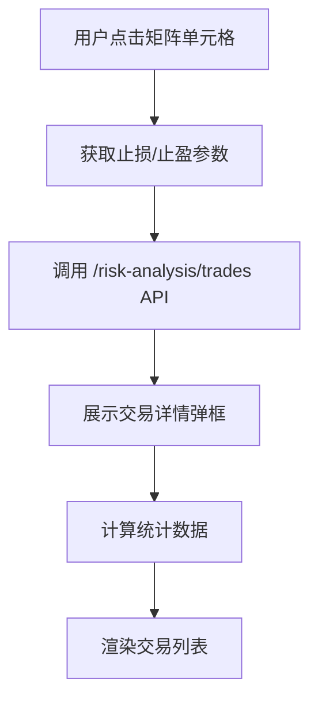

# 风险分析矩阵交互功能使用说明

## 🎯 功能概述

风险分析矩阵现在支持交互式查看详细交易数据。点击矩阵中的任意单元格，可以弹出该止盈止损策略组合下的所有交易详情。

## 🚀 主要特性

### 1. **交互式矩阵**
- ✅ 可点击的矩阵单元格
- 🎯 悬停时显示提示信息
- 🖱️ 光标变为指针，表示可点击

### 2. **详细交易列表**
- 📊 每个策略组合下的所有交易记录
- 💰 实时计算统计数据（总盈亏、胜率、交易数量等）
- 🏷️ 清晰的交易标签（LONG/SHORT、已完成/未完成）

### 3. **丰富的交易信息**
- 📈 **基础信息**: 开仓价、平仓价、数量、盈亏金额和百分比
- 🎯 **策略指标**: 是否触发止损/止盈、最大回撤等
- ⏰ **时间信息**: 开仓时间、平仓时间
- 🔍 **视觉标识**: 盈利/亏损颜色区分、策略触发图标

## 📱 使用流程

### 步骤1: 打开风险分析矩阵
```javascript
// 在交易分析页面点击"最佳止盈止损分析"按钮
// 或直接使用组件：
<RiskAnalysisDialog 
  open={true}
  symbol="ETHUSDC"
  // ... 其他参数
/>
```

### 步骤2: 浏览矩阵数据
- 🟢 **绿色单元格**: 表示该策略组合盈利
- 🔴 **红色单元格**: 表示该策略组合亏损
- 🎨 **颜色深浅**: 反映盈亏程度的大小

### 步骤3: 点击查看详情
- 点击感兴趣的矩阵单元格
- 系统自动请求该策略组合的详细交易数据
- 弹出交易详情对话框

### 步骤4: 分析交易详情
- 📊 查看顶部的统计概览
- 📝 浏览详细的交易列表
- 🏷️ 关注交易标签和状态

## 🎨 界面设计

### 统计卡片
```
┌─────────────────────────────────────────────────────┐
│  [总交易数]  [总盈亏]  [盈利交易]  [胜率]           │
│     15        +1,234     8        53.3%              │
└─────────────────────────────────────────────────────┘
```

### 交易卡片
```
┌─────────────────────────────────────────────────────┐
│ [LONG] #round_id_123          +245.67 (+2.34%)       │
├─────────────────────────────────────────────────────┤
│ 开仓价: 3,456.78  平仓价: 3,567.89                  │
│ 数量: 100.0000    [🎯止盈] [🔻止损]                 │
├─────────────────────────────────────────────────────┤
│ 开仓时间: 2024-01-15 09:30:00                       │
│ 平仓时间: 2024-01-15 15:45:00                       │
└─────────────────────────────────────────────────────┘
```

## 🔧 技术实现

### API 接口
- **矩阵数据**: `GET /risk-analysis/matrix`
- **交易详情**: `GET /risk-analysis/trades`

### 关键参数
```typescript
interface TradeQueryParams {
  symbol: string;
  stopLossPercentage: number;    // 止损百分比
  takeProfitPercentage: number;  // 止盈百分比
  // 其他筛选条件...
}
```

### 组件架构
```
RiskAnalysisDialog (主对话框)
├── RiskMatrixTable (矩阵表格)
│   └── onCellClick 事件处理
└── RiskAnalysisTradesDialog (交易详情弹框)
    ├── 统计信息展示
    └── 交易列表展示
```

## 📊 数据流



## 🎯 使用场景

### 1. **策略效果分析**
- 比较不同止损/止盈组合的效果
- 找到最优的风险控制参数
- 分析策略的实际执行情况

### 2. **交易复盘**
- 查看具体交易的执行细节
- 分析止损/止盈的触发情况
- 评估风险控制的有效性

### 3. **参数优化**
- 基于历史数据优化止损/止盈参数
- 找到最适合当前市场的策略组合
- 提高交易的风险收益比

## 🔍 高级功能

### 交易状态标识
- 🟢 **盈利交易**: 绿色金额显示
- 🔴 **亏损交易**: 红色金额显示
- ⏰ **未完成**: 带有时钟图标的橙色标签
- 🎯 **止盈触发**: 绿色向上箭头图标
- 📉 **止损触发**: 红色向下箭头图标
- ⚠️ **深度回撤**: 橙色警告图标

### 数据筛选
- 支持按时间范围筛选
- 支持按盈亏范围筛选
- 支持按交易量筛选
- 支持按持仓方向筛选

### 响应式设计
- 适配不同屏幕尺寸
- 移动端友好的触摸交互
- 自动调整列数和布局

## 🚨 注意事项

1. **数据实时性**: 交易数据可能有延迟，请以实际执行为准
2. **策略回测**: 分析结果基于历史数据，不代表未来表现
3. **风险提醒**: 止损/止盈策略不能完全消除交易风险

## 📞 技术支持

如遇到问题，请检查：
1. 网络连接是否正常
2. 后端服务是否运行
3. 数据权限是否充足
4. 浏览器控制台是否有错误信息

---

**最后更新**: 2024-01-15  
**版本**: v1.0.0
